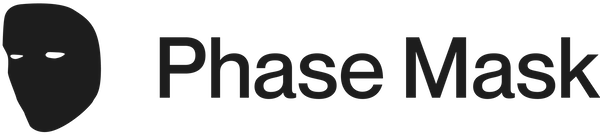

  
  Thesis Project: <a href="https://mfadt.zachkrall.com">mfadt.zachkrall.com</a>

## about

Phase Mask is a live-coding environment for making visual art with face tracking geometries

## installation

...

## usage

...

## license

Copyright © 2020 [Zach Krall](https://zachkrall.com) This project is [Imagine](./LICENSE) licensed 
[https://github.com/sterlingcrispin/imaginelicense](https://github.com/sterlingcrispin/imaginelicense)
